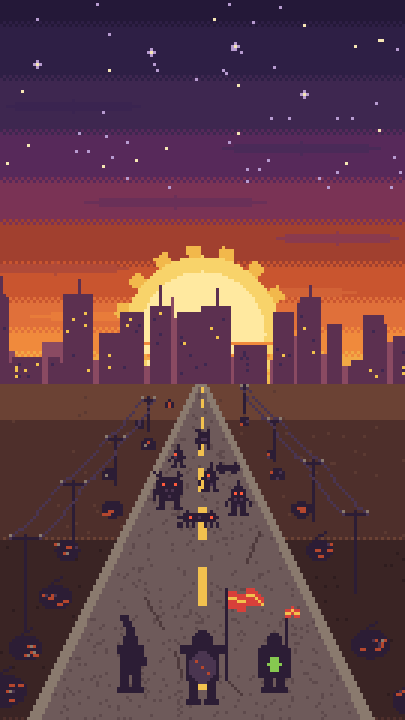
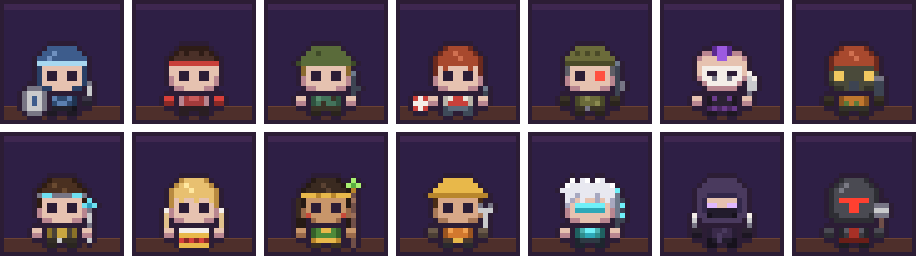
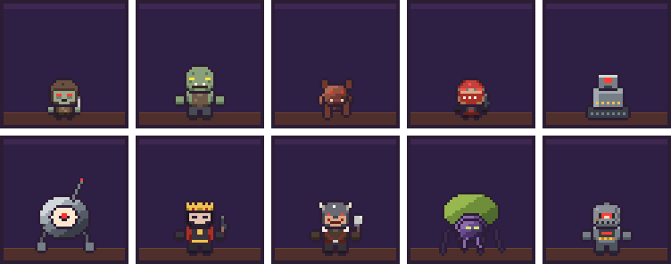

  

  <b>Your squad marches across the wasteland. You make it stronger.</b> 
  <a href="https://github.com/nuuse/ScrapParade-builds/releases/latest"><b>⬇ Download the latest playtest</b></a>
  &nbsp;·&nbsp; <a href="#deutsch">Deutsch</a>

> **Scrap Parade is in early development.** These are playtest builds for Windows and Android; a lot is still placeholder and numbers change all the time.

## The parade marches on

A post-apocalyptic **idle auto-runner**. Your squad walks towards a distant horizon, fights everything that crosses the road and
brings home scrap. You do not steer, you optimise: peek in for a minute to collect and upgrade, or stay and push the next boss.

- **Auto-battle with a say.** Time your squad's skills, or let them run on their own.
- **Build the squad.** Tanks, melee fighters, ranged units and support, each with their own gear, skill and tactics.
- **Never stop improving.** Upgrades, loot with rarities, recruiting, research, a workshop and drones that fight beside you.
- **A living wasteland.** Day and night, storms, acid rain and sandstorms, forks in the road and detours, and the odd rat or cat crossing your path.
- **Play together.** Arena duels against other players' squads, rankings and clans.
- **Idle-friendly.** Progress continues while you are away.
- **Your language.** 13 languages, including right-to-left and CJK.

 

## Meet the squad

## What waits on the road

Scavengers, mutant hounds, raiders and rogue machines, and hulking brutes like the Scrap Titan.

## Play the playtest

Get the newest version from the **[Releases page](https://github.com/nuuse/ScrapParade-builds/releases/latest)**.

| | |
|---|---|
| **Windows** | Download `ScrapParade-<version>.zip`, unpack it into its own folder and start `ScrapParade.exe`. The game updates itself when a newer version is out. |
| **Android** | Download `ScrapParade-<version>.apk` and open it. Updates are manual: the game shows a link to the new APK. |

---

## Deutsch

**Dein Trupp marschiert durchs Ödland. Du machst ihn stärker.**

Scrap Parade ist ein **Idle-Auto-Runner** in der Postapokalypse. Der Trupp läuft auf einen fernen Horizont zu, kämpft gegen alles,
was auf der Straße steht, und bringt Schrott nach Hause. Du steuerst nicht, du optimierst: kurz reinschauen, abholen und upgraden,
oder dranbleiben und den nächsten Boss pushen.

- **Auto-Kampf mit Mitsprache.** Skills timen oder den Trupp einfach laufen lassen.
- **Trupp aufbauen.** Tanks, Nahkämpfer, Fernkämpfer und Support, jede Figur mit eigener Ausrüstung, eigenem Skill und eigener Taktik.
- **Immer etwas zu verbessern.** Upgrades, Beute mit Seltenheiten, Rekrutierung, Forschung, Werkstatt und Drohnen, die mitkämpfen.
- **Ein lebendiges Ödland.** Tag und Nacht, Sturm, saurer Regen und Sandstürme, Gabelungen und Umwege, und ab und zu läuft eine Ratte oder Katze über die Straße.
- **Gemeinsam spielen.** Arena-Duelle gegen die Trupps anderer Spieler, Ranglisten und Clans.
- **Idle-tauglich.** Der Fortschritt läuft weiter, wenn du nicht da bist.
- **In deiner Sprache.** 13 Sprachen, auch von rechts nach links und CJK.

### Playtest

Die neueste Version gibt es auf der **[Releases-Seite](https://github.com/nuuse/ScrapParade-builds/releases/latest)**.

| | |
|---|---|
| **Windows** | `ScrapParade-<Version>.zip` herunterladen, in einen eigenen Ordner entpacken und `ScrapParade.exe` starten. Das Spiel aktualisiert sich selbst, wenn es eine neuere Version gibt. |
| **Android** | `ScrapParade-<Version>.apk` herunterladen und öffnen. Updates sind manuell: Das Spiel zeigt einen Link zur neuen APK. |

*Scrap Parade ist in früher Entwicklung. Vieles ist noch Platzhalter, und Zahlen ändern sich ständig.*
