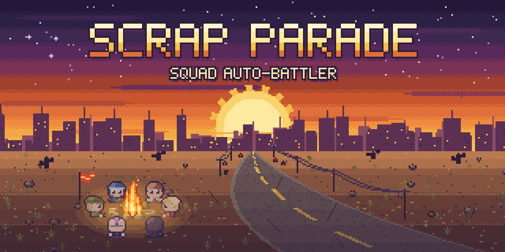
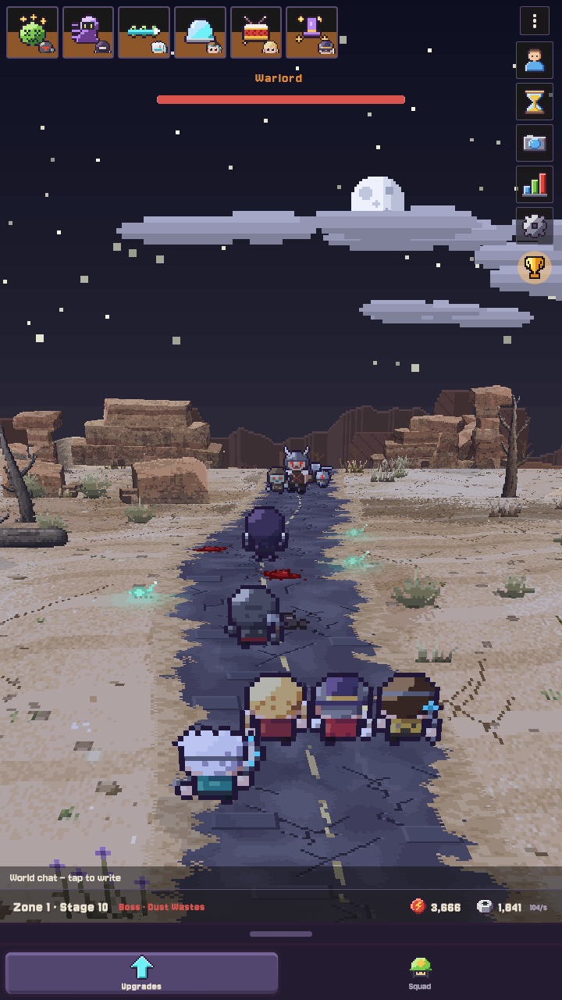
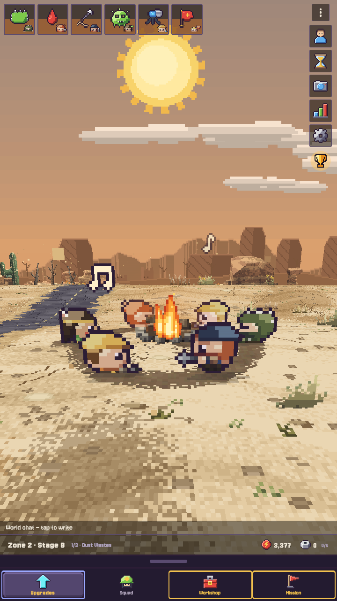
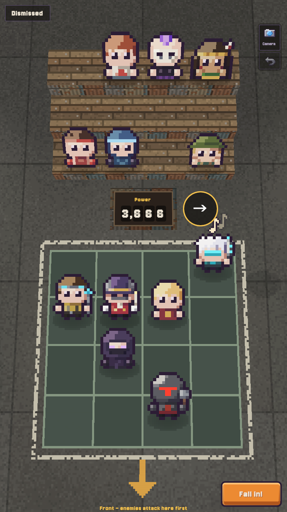
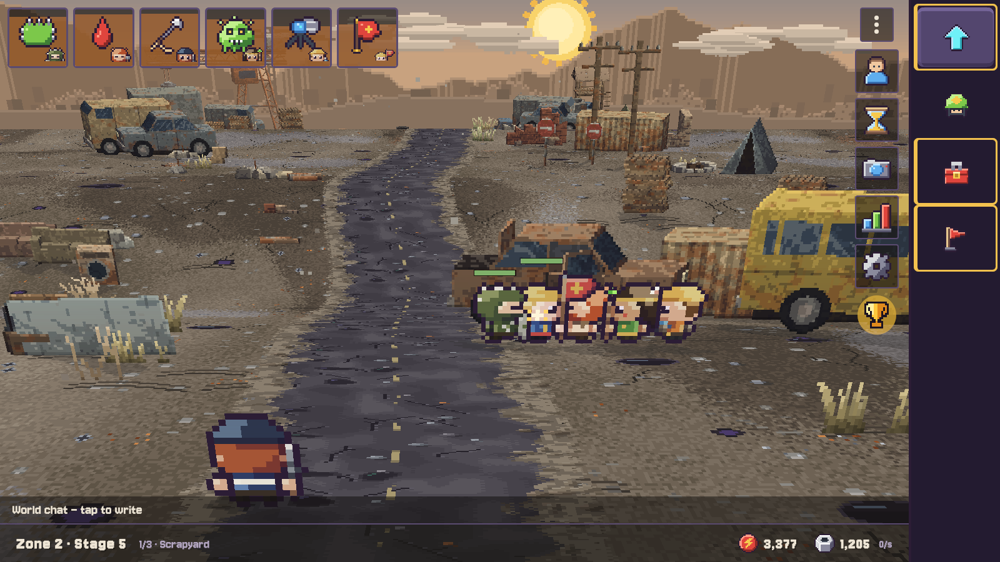
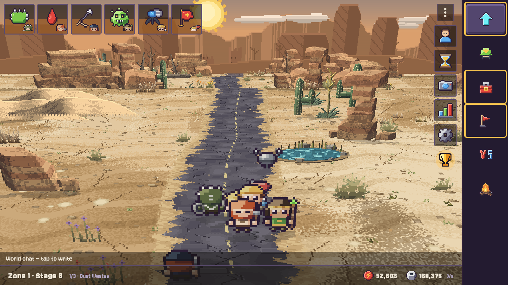
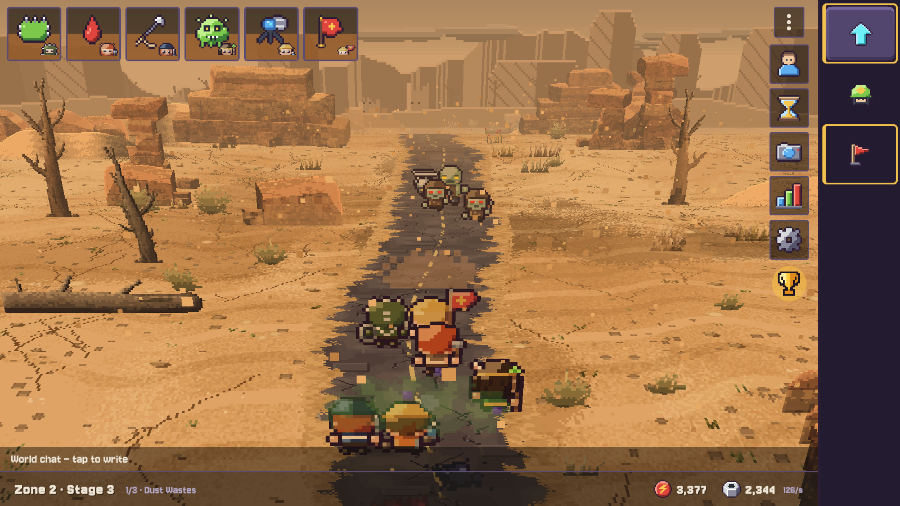
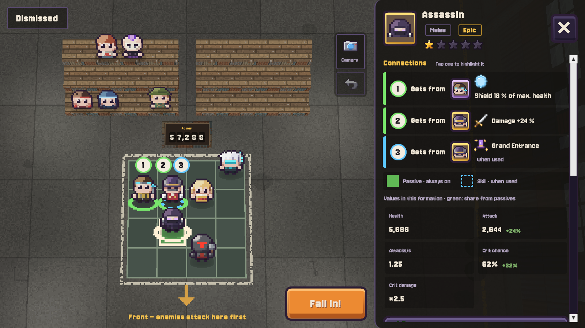
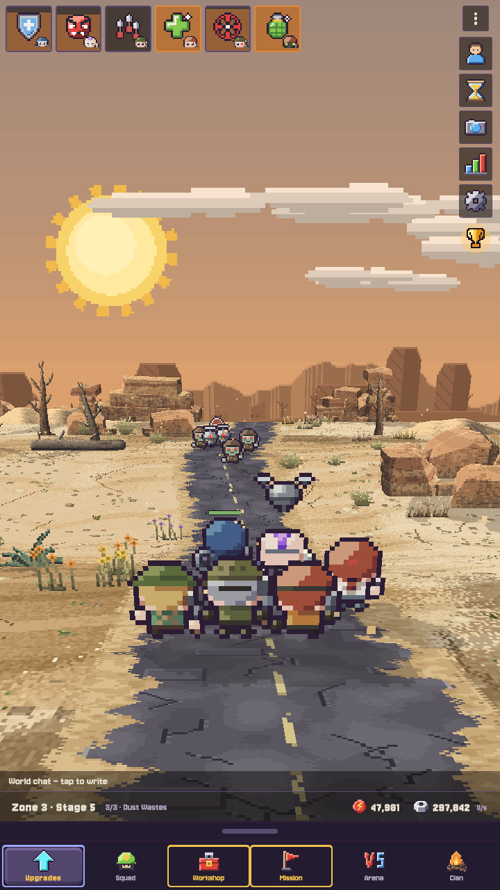

  

  <b>You set the lineup. Your squad does the fighting.</b> 
  <a href="https://github.com/nuuse/ScrapParade-builds/releases/latest"><b>⬇ Download the latest playtest</b></a>
  &nbsp;·&nbsp; <a href="#gallery">Gallery</a>
  &nbsp;·&nbsp; <a href="#feedback">Feedback</a>
  &nbsp;·&nbsp; <a href="#deutsch">Deutsch</a>

  
  
  

> **Scrap Parade is in early development.** These are playtest builds for Windows and Android. Plenty of it is still placeholder, and the numbers move around a lot.

## The parade marches on

A post-apocalyptic **squad auto-battler**. You pick your fighters and decide who stands where. Then the parade marches off on its own, fights whatever steps onto the road and drags the scrap home. Check in for a minute to collect, upgrade and shuffle the lineup, or stick around and go for the next boss.

- **The lineup decides.** Tanks, melee, ranged and support, each with their own gear and skill. On the parade ground it matters who stands next to whom: neighbours buff each other. Save your favourite lineups and swap them in a tap.
- **Auto-battle, but you get a say.** Fire skills yourself at the right moment, or leave it to the squad.
- **Always something to upgrade.** Loot in several rarities, recruiting, research, a workshop, and drones that join the fight.
- **The wasteland doesn't sit still.** Five biomes, day and night, storms and sandstorms, forks in the road. Sometimes an oasis. Sometimes a junkyard full of wrecks.
- **Not alone out there.** Arena duels against other players' squads, rankings and clans.
- **Idle means idle.** The squad keeps walking while you're away.

## Gallery

  
  

<i>Junkyard: strip a wreck · A rare oasis</i>

  
  

<i>Sandstorm. The parade doesn't stop for weather. · Connections: neighbours on the parade ground buff each other</i>

  

<i>On the road</i>

## How to play

Grab the newest version from the **[Releases page](https://github.com/nuuse/ScrapParade-builds/releases/latest)**.

**Windows** (64 bit, Windows 10 or 11)
1. Download `ScrapParade-<version>.zip` and unpack it into a folder of its own.
2. Run `ScrapParade.exe`. Windows may warn you because the file isn't signed: click *More info*, then *Run anyway*.
3. Done. When a new version is out, the game asks at start, updates itself and restarts. Your progress stays.

**Android** (7.1 or newer, 64 bit)
1. Download `ScrapParade-<version>.apk` on your phone and open it. If asked, allow your browser to install apps.
2. Updates are manual: the game shows you a link to the new APK. Install it over the old one.

Online features (cloud save, chat, arena, clans) need a sign-in. Playtest builds send anonymous usage data and error reports; details in the [privacy policy](https://nuuse.github.io/idlerunner-legal/privacy.html).

## What's new

The latest playtest (9 October) is a **fresh start**. All accounts were reset, and every fighter starts at 2 stars.

- New balancing for upgrades, enemies, recruiting and research (now with 2 research slots).
- New: forks in the road and the boss wall. Detours are rarer.
- Biome events like the oasis or the junkyard now give rewards.

Every version with its notes: **[all releases](https://github.com/nuuse/ScrapParade-builds/releases)**.

## Feedback

The game isn't finished. That's the point of testing it, and why your notes help.

- **Something broke?** In the game: *Settings → Report an error*. It sends the error log and your game version. Add a line on what happened if you like.
- **Anything else?** What annoys you, what's unclear, what's missing, what's fun: tell the person who sent you this link.
  Short notes are perfect ("boss 2 felt impossible", "couldn't find the workshop").

**Download, play a few runs, tell us what you think.** Thanks for testing!

<a href="https://github.com/nuuse/ScrapParade-builds/releases/latest"><b>⬇ Download the latest playtest</b></a>

---

## Deutsch

**Du stellst auf. Dein Squad kämpft.**

Scrap Parade ist ein **Squad-Auto-Battler** nach dem Weltuntergang. Du wählst deine Kämpfer und legst fest, wer wo steht. Dann zieht die Parade von selbst los, legt sich mit allem an, was auf der Straße steht, und schleppt den Schrott heim. Kurz reinschauen, einsammeln, aufrüsten, die Aufstellung umbauen. Oder dabeibleiben und den nächsten Boss knacken. Bilder gibt es in der [Galerie](#gallery).

### So spielst du

Die neueste Version liegt auf der **[Releases-Seite](https://github.com/nuuse/ScrapParade-builds/releases/latest)**.

**Windows** (64 Bit, Windows 10 oder 11)
1. `ScrapParade-<Version>.zip` herunterladen und in einen eigenen Ordner entpacken.
2. `ScrapParade.exe` starten. Windows warnt eventuell, weil die Datei nicht signiert ist: *Weitere Informationen*, dann *Trotzdem ausführen*.
3. Fertig. Gibt es eine neue Version, fragt das Spiel beim Start, aktualisiert sich selbst und startet neu. Dein Spielstand bleibt erhalten.

**Android** (ab 7.1, 64 Bit)
1. `ScrapParade-<Version>.apk` auf dem Handy herunterladen und öffnen. Falls gefragt: dem Browser erlauben, Apps zu installieren.
2. Updates gehen hier von Hand: Das Spiel zeigt dir einen Link zur neuen APK, die du einfach über die alte installierst.

Online-Funktionen (Cloud-Spielstand, Chat, Arena, Clans) brauchen eine Anmeldung. Playtest-Versionen senden anonyme Nutzungsdaten und Fehlerberichte; Details in der [Datenschutzerklärung](https://nuuse.github.io/idlerunner-legal/privacy.html).

### Was ist neu

Der aktuelle Playtest (9. Oktober) ist ein **Neustart**. Alle Konten wurden zurückgesetzt, alle Figuren fangen bei 2 Sternen an.

- Neues Balancing für Upgrades, Gegner, Rekrutieren und Forschung (jetzt mit 2 Forschungsplätzen).
- Neu: Gabelungen und die Boss-Wand. Umwege gibt es seltener.
- Biom-Events wie Oase oder Autofriedhof bringen jetzt Belohnungen.

Alle Versionen mit Änderungen: **[alle Releases](https://github.com/nuuse/ScrapParade-builds/releases)**.

### Feedback

- **Etwas kaputt?** Im Spiel: *Einstellungen → Fehler melden*. Das schickt das Fehlerprotokoll und deine Version mit. Wenn du magst, schreib kurz dazu, was passiert ist.
- **Alles andere?** Was nervt, was unklar ist, was fehlt, was Spaß macht: Sag es der Person, die dir den Link geschickt hat.
  Kurze Notizen reichen völlig („Boss 2 war nicht zu schaffen“, „Werkstatt nicht gefunden“).

**Runterladen, ein paar Runden spielen, Bescheid sagen.** Danke fürs Testen!
